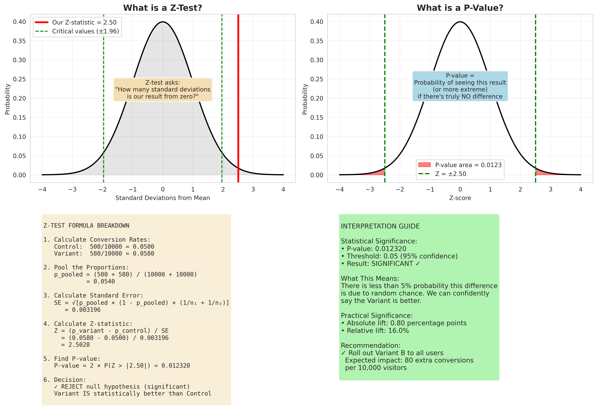

# A/B Testing Statistical Breakdown

## What Statistical Test is Being Used?

Your tutorial uses a **Two-Proportion Z-Test**, which is the standard statistical test for A/B testing. Here's what's happening:

### The Z-Test Formula

```
Z = (p₁ - p₂) / SE

Where:
- p₁ = Variant conversion rate
- p₂ = Control conversion rate  
- SE = Standard Error = √[p_pooled × (1 - p_pooled) × (1/n₁ + 1/n₂)]
- p_pooled = (conversions₁ + conversions₂) / (visitors₁ + visitors₂)
```

### Why Z-Test and Not T-Test?

**Z-Test** is used when:
- ✓ Large sample sizes (n > 30) - typical for web A/B tests
- ✓ Known population variance (estimated from data)
- ✓ Testing proportions/percentages

**T-Test** is used when:
- Small sample sizes (n < 30)
- Unknown population variance
- Testing means (not proportions)

For A/B tests with thousands of visitors, the z-distribution and t-distribution are virtually identical, so z-test is the standard choice.

## The 6 Visualizations Explained

### 1. **Sampling Distributions**
Shows the probability distributions of conversion rates for Control and Variant. The wider apart these are, the more different they are.

### 2. **Z-Test Visualization**  
Shows where your z-statistic falls on the standard normal curve. If it's beyond ±1.96 (the red rejection regions), your result is significant at 95% confidence.

### 3. **P-Value Visualization**
The red shaded areas show the p-value - the probability of seeing your result (or more extreme) if there's truly no difference. Smaller = more significant.

### 4. **Confidence Intervals**
Shows the conversion rates with error bars representing uncertainty. If the error bars don't overlap much, results are likely significant.

### 5. **Statistical Power**
Shows Type I errors (false positives - claiming a difference when there isn't one) vs Type II errors (false negatives - missing a real difference).

### 6. **Sample Size vs Power**
Shows how increasing sample size increases your ability to detect real differences. The green line shows you need about the sample size shown for 80% power.

## Using the Python Visualizations

### Installation

```bash
pip install numpy matplotlib scipy seaborn --break-system-packages
```

### Running the Script

```bash
python ab_test_visualizations.py
```

This generates:
- `ab_test_statistical_breakdown.png` - Comprehensive 6-panel visualization
- `ab_test_explained.png` - Simplified explanations

### Customizing for Your Data

Edit the top of the script:

```python
# Change these values to your actual test data
control_visitors = 10000      # Your control group size
control_conversions = 500     # Your control conversions
variant_visitors = 10000      # Your variant group size  
variant_conversions = 580     # Your variant conversions
```

Then run the script to generate visualizations for your specific test!

## Adding Visualizations to Your Tutorial

To add these visualizations to your web tutorial:

### Option 1: Upload Images to GitHub
1. Add the PNG files to your repository
2. In `ab-testing-tutorial.html`, add an image section:

```html
<section class="tutorial-section">
    <h2>Statistical Breakdown</h2>
    <p>Here's a visual breakdown of the statistics behind A/B testing:</p>
    
    
    
    
</section>
```

### Option 2: Create Interactive Plots with D3.js
Convert the Python visualizations to interactive JavaScript using D3.js or Plotly.js for a fully web-based experience.

### Option 3: Embed Jupyter Notebook
Convert the Python script to a Jupyter notebook and embed it using nbviewer or JupyterLab.

## How Hard Would It Be to Create This in Python?

**Answer: Not hard at all!** The script I created is ~300 lines and uses standard libraries:

**Difficulty: 3/10** if you know:
- Basic Python
- NumPy for arrays
- Matplotlib for plotting
- Basic statistics concepts

**What makes it easier:**
- `scipy.stats` handles all the math (z-scores, p-values, distributions)
- `matplotlib` is well-documented for plotting
- `seaborn` makes things prettier automatically

**Time to build from scratch:** 2-3 hours if you're learning, 30 minutes if experienced

## Key Statistical Concepts Visualized

### 1. **Null Hypothesis (H₀)**
"There is no difference between Control and Variant"

### 2. **Alternative Hypothesis (H₁)**  
"There IS a difference between Control and Variant"

### 3. **P-Value**
Probability of seeing your result if H₀ is true. Small p-value → reject H₀

### 4. **Statistical Significance**
P-value < 0.05 means <5% chance result is due to randomness

### 5. **Type I Error (α)**
False positive - saying there's a difference when there isn't (usually 5%)

### 6. **Type II Error (β)**
False negative - missing a real difference (usually 20%)

### 7. **Statistical Power (1-β)**
Probability of detecting a real difference (usually aim for 80%)

## Next Steps: Interactive Visualizations

Want to make these interactive in your browser? Here are approaches:

### Easy: Plotly Python → HTML
```python
import plotly.graph_objects as go

fig = go.Figure(data=[
    go.Scatter(x=x, y=y, name='Distribution')
])
fig.write_html("interactive_plot.html")
```

### Medium: D3.js
Write JavaScript to create fully custom interactive visualizations

### Advanced: Dash or Streamlit
Build a full interactive dashboard where users can input their own data

## Resources for Learning More

- **Statistics**: "Statistics for Hackers" by Jake VanderPlas
- **Python Viz**: Official matplotlib and seaborn galleries
- **A/B Testing**: Evan Miller's blog (evanmiller.org)
- **Interactive Viz**: D3.js Observable notebooks

## Common Questions

**Q: Why 95% confidence (p < 0.05)?**
A: Convention. Some companies use 90% or 99% depending on risk tolerance.

**Q: Can I use t-test instead?**
A: For large samples (n > 1000), z-test and t-test give identical results.

**Q: What about multiple testing?**
A: If testing multiple variants simultaneously, use Bonferroni correction or similar.

**Q: How do I handle multiple metrics?**
A: Define ONE primary metric before testing. Secondary metrics are for exploration.

**Q: What if my test never reaches significance?**
A: Either there's truly no difference, or you need more traffic/bigger change to detect it.

---

**Ready to dive deeper?** Try modifying the Python script with your own A/B test data and see how the visualizations change!
